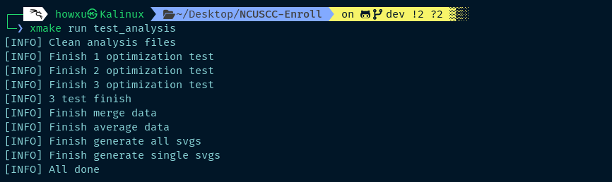

# NCUSCC 2024秋超算考核试题 C语言试题

实现冒泡排序、基础堆排序以及斐波那契堆排序,有完整的测试单元和构建脚本,使用Python生成svg矢量图

报告在本仓库[REPORT.MD](./REPORT.MD)文件.

# 构建和测试

## 拉取项目

本项目使用[Unity测试框架](https://github.com/ThrowTheSwitch/Unity)，因此请使用下列命令克隆:

```bash
git clone --recursive SSH链接或者HTTPS链接
```

## 硬件情况

**CPU: Intel E5 2666 V3**  

**RAM: 8Gx4 1866Hz**  

## 测试环境和依赖

**OS: Kali Linux 2024.3 amd64**  

**Compiler: gcc version 14.2.0 (Debian 14.2.0-3)**  

**Make Tool: xmake v2.9.5+20241005**  

**Others**:  
GNU gprof (GNU Binutils for Debian) 2.43.1  
Python 3.12.6  

## 构建命令

### 依赖安装:

```bash
pip install matplotlib pandas
```

> [!NOTE]\
> 如果你也使用Kali，则应该使用下面的命令
```bash
pip install matplotlib pandas --break-system-packages
```

### 构建算法测试:

```bash
xmake f --mode=release
xmake
xmake run test_runnable
```
预计结果:


### 构建性能测试:

```bash
xmake f --mode=debug
xmake
xmake run test_analysis
```
预计结果:



之后在`./report/all`和`./report/single`文件夹可以找到生成的矢量图,在`./report/average`文件夹下有取平均之后的测试数据

下一次算法测试前需要清理上一次的结果:

```bash
xmake run test_clean
```
