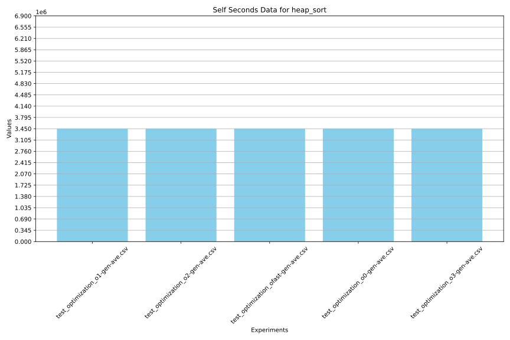

# NCUSCC 2024秋超算考核试题 C语言试题报告

<font size=5>Author: HowXu</font>  

# 试题要求

1. 安装虚拟机：
    - 在虚拟机中安装 Ubuntu 22.04 LTS 操作系统。
    - 配置虚拟机的网络连接，确保可以正常联网。
2. 安装 C 语言编译器：
    - 安装最新版本的 gcc（可通过 PPA 安装最新稳定版）。
    - 验证编译器安装成功，并确保其正常工作。
3. 实现排序算法：
    - 使用 C 语言手动实现以下排序算法：冒泡排序、基础堆排序以及斐波那契堆排序，不调用任何库函数。
    - 运行测试代码，确认各排序算法的正确性。
4. 生成测试数据：
    - 编写代码或脚本自动生成测试数据（随机生成浮点数或整数）。
    - 测试数据应覆盖不同规模的数据集，其中必须包含至少 100 000 条数据的排序任务。
5. 编译与性能测试：
    - 使用不同等级的 gcc 编译优化选项（如 -O0, -O1, -O2, -O3, -Ofast 等）对冒泡排序和堆排序代码进行编译。
    - 记录各优化等级下的排序算法性能表现（如执行时间和资源占用）。
6. 数据记录与可视化：
    - 收集每个编译等级的运行结果和性能数据。
    - 分析算法的时间复杂度，并将其与实验数据进行对比。
    - 将数据记录在 CSV 或其他格式文件中。
    - 使用 Python、MATLAB 等工具绘制矢量图，展示实验结论。
7. 撰写实验报告：
    - 撰写一份详细的实验报告，内容应包括：
        - 实验环境的搭建过程（虚拟机安装、网络配置、gcc 安装等）。
        - 冒泡排序、基础堆排序和斐波那契堆排序的实现细节。
        - 测试数据的生成方法。
        - 不同编译优化等级下的性能对比结果。
        - 数据可视化部分（附图表）。
        - 实验过程中遇到的问题及解决方案。
    - 报告必须采用 LaTeX 或 Markdown 格式撰写。

# 实验报告

## 实验环境搭建

### 1.VMWare虚拟安装Ubuntu 22.04 LTS操作系统  

(1) 前往清华开源镜像站下载Ubuntu 22.04 LTS amd64镜像:  


(2) 打开VMWare虚拟机,选择创建新的虚拟机  


(3) 按照如下设置配置虚拟机信息,因为参与大量数据计算,需要修改CPU数量、核心、运行内存:  


<div style="width: 100%; margin: 0 auto;">
  
</div>

在操作系统选择中选择Ubuntu 64位  


<div style="width: 100%; margin: 0 auto;">
  
</div>


选中Ubuntu 22.04 LTS iso文件  


(4)启动虚拟机,选择Try Or Install Ubuntu选项,进行安装:    


选择最小安装设置,取消更新勾选:  


安装完成后在虚拟机设置中关闭iso文件自动连接:  

<div style="width: 100%; margin: 0 auto;">
  
</div>

<div style="width: 100%; margin: 0 auto;">
  
</div>


再次开机,进入Ubuntu桌面:  


(5)运行`sudo apt update`更新源,顺带检测网络连接情况,在本实验中使用VMWare的默认虚拟机设置,无需修改即可访问物理机网络:  


### 2.安装C语言编译器

(1)安装gcc编译器工具,使用`sudo apt install build-essential`命令进行安装:  


分别使用`gcc -v`和`g++ -v`检测gcc和g++命令是否正常:


(2)附加选项:安装Xmake

因为本实验大量使用脚本进行测试，所以引入`xmake`这款构建工具来减少实验者心智负担.

```bash
curl -fsSL https://xmake.io/shget.text | bash
```

## 算法的实现细节 测试数据生成方法 

### 3.4.实现算法,算法测试和大量数据测试

(1)算法实现

使用xmake构建工具生成一个空的C语言项目:

```bash
xmake create -l c NCUSCC-Enroll
```

稍微修改`xmake.lua`配置文件,在`include/sort.h`文件中声明函数原型,在`src`目录下分别对算法进行实现.

注意到本次实验同时对int和float两种类型存在要求,因此在实现过程中需要引入新的联合类型`data`,并确保函数编写过程中具有对两种类型数据的普适性.

算法实现细节如下:

<font size=6 color=red>冒泡排序:</font>

冒泡排序的核心在于每次循环都可以通过多次对相邻两组数据的进行大小比较,以确保每次外循环结束时都有至少一个最大(最小)元素到达端点,因此只需要两个嵌套的循环就可以实现.

参考`src/bubble_sort.c`

<font size=6 color=red>简单堆排序:</font>

简单堆排序使用二叉堆这种数据结构进行比较排序,需要指出的是对于本实验中参与排序的数组仅仅是无序数组,需要先将其转换为最大(最小)堆,之后不断取出堆顶元素放在堆尾,再通过调整剩下元素为一个新的堆,重复上述过程最后得到的数组就会按照大(小)顺序排列.  

参考`src/heap_sort.c`

<font size=6 color=red>斐波纳契堆排序:</font>

斐波纳契堆是一种用于实现优先队列的数据结构,此处的斐波纳契堆排序实际上是以数组元素构建斐波纳契堆这种数据结构,然后通过操作生成的斐波纳契堆进行排序.

鉴于实验者智商确实不是很高,这个算法的实现绝大部分来自AI.

参考`src/fib_heap_sort.c`

(2)算法测试

首先编写一个简单的随机数生成器,在`include/random.h`中声明,在`src/random.c`中实现.

为减少心智负担,引入C语言测试框架[Unity](https://github.com/ThrowTheSwitch/Unity),并在根目录下新建`test`目录进行测试.

设置不同的设置类型,通过随机数生成器产生大量数据参与测试:

```c
    int len = 100000;
    union data *arr1 = get_random_array(1, 250000, len, INT);
```

使用Unity框架带有的断言进行多次匹配:

```c
    //断言
    for (size_t i = 0; i < len; i++)
    {
        /* code */
        TEST_ASSERT_EQUAL_INT(arr1[i].i, arr2[i].i);
        TEST_ASSERT_EQUAL_INT(arr2[i].i, arr3[i].i);
        TEST_ASSERT_EQUAL_INT(arr3[i].i, arr1[i].i);

        TEST_ASSERT_EQUAL_FLOAT(arr4[i].i, arr5[i].i);
        TEST_ASSERT_EQUAL_FLOAT(arr5[i].i, arr6[i].i);
        TEST_ASSERT_EQUAL_FLOAT(arr6[i].i, arr4[i].i);
    }
```

在本次实验中,实验者可以使用以下命令直接进行测试:  

```bash
xmake f --mode=release #切换编译模式,因为后续存在特定编译
xmake #启动全编译
xmake run test_runnable
```

运行结果如下:


表明算法完全正常.

##  不同编译优化等级下的性能对比结果 数据可视化部分

### 5.6.编译,性能测试与数据收集可视化

使用GNU项目自带的`gprof`命令进行性能测试

首先在`test`目录下新建测试文件,使用统一的种子生成随机数减少误差,添加三种函数的测试项目.

使用C标准库自带的rand函数获得一个随机数,再按照一定的放大(缩小),数据转化获得需要的数据.同时为了确保参与测试的数据具有唯一性,使用srand函数指定随机数种子,传入time获得的时间戳来确保种子唯一性,在这种情况下的伪随机数已经可以达到本实验的要求.

为方便后续统计,需要同时编写两个相同的`swap`函数.

(1)增加编译选项

修改`xmake.lua`脚本,新增编译时选项和链接时选项，保证编译产物可以输出桩信息:

```lua
if is_mode("debug") then 
    add_cflags("-g","-pg","-O0")  -- 添加编译选项，生成性能分析信息
    add_ldflags("-pg")  -- 添加链接选项，生成性能分析信息
end
```

同时需要关闭xmake自带的`-O3`优化:

```bash
-- 关闭优化
set_optimize("none")
```

新增不同的编译对象并增加运行时逻辑使其运行信息输出到文件中:

```lua
target("test_optimization_o0")
    set_kind("binary")
    set_targetdir(get_dir("test_optimization_o0"))
    add_files(OPM)
    add_deps("NCUSCC-Enroll")
    add_cflags("-O0")
    after_run(function (target)
        local output = os.iorun(string.format("gprof %s/%s/%s %s/%s/gmon.out",OPM_TGT,target:name(),target:name(),OPM_TGT,target:name()))
        io.writefile(string.format("./analysis/%s.txt",target:name()),output)
        os.run(string.format("rm %s/%s/gmon.out",OPM_TGT,target:name()))
    end)
```

(2)编写Python脚本进行数据收集

为了使用Python导出csv格式数据，需要先行安装pandas库:

```bash
pip install pandas
```

在(1)中已经使用xmake进行数据重定向输出,现编写`formate.py`脚本将`gprof`产生的分析文件格式化，提取其中的CPU运行占比,运行时间,运行次数等关键信息,同时删除如test函数,main函数的干扰.

为确保数据的可靠性,对剔除数据后的数据需要对CPU运行占比进行重新计算.

最后将文件导出为`.csv`格式,如下图:


(3)实验数据处理与可视化

先行安装`matplotlib`库

```bash
pip install matplotlib
```

编写Python脚本,将多次实验的数据进行统计,并将相关的函数调用情况合并,求平均值,最后使用`matplotlib`库绘制svg矢量图.如下:


再次编写`xmake.lua`脚本,添加特定的target实现自动化操作:

```lua
target("test_analysis")
    set_kind("phony")
    add_deps("test_optimization_o0","test_optimization_o1","test_optimization_o2","test_optimization_o3","test_optimization_ofast")
    before_run(function (target) 
        -- clean
        os.run(RM_ANA)
        print("[INFO] Clean analysis files")
    end)
    on_run(function (target)  
        -- 循环获得10次数据
        for i = 1, TIMES do
        --生成一次运行记录
        os.run("xmake run test_optimization_o0")
        os.run("xmake run test_optimization_o1")
        os.run("xmake run test_optimization_o2")
        os.run("xmake run test_optimization_o3")
        os.run("xmake run test_optimization_ofast")
        --生成report
        os.run("python3 ./script/formate.py")
        -- clean
        os.run(RM_ANA)
        print(string.format("[INFO] Finish %d optimization test",i))
        end
        print(string.format("[INFO] %d test finish",TIMES))
        -- 合并
        os.run("python3 ./script/merge.py")
        print("[INFO] Finish merge data")
        -- 求平均值
        os.run("python3 ./script/average.py")
        print("[INFO] Finish average data")
        -- 生成全比较图
        os.run("python3 ./script/gen_all_svg.py")
        print("[INFO] Finish generate all svgs")
        -- 生成单个比较图
        os.run("python3 ./script/gen_sin_svg.py")
        print("[INFO] Finish generate single svgs")
    end)
    after_run(function (target) 
        -- clean
        os.run(RM_ANA)
        print("[INFO] All done")
    end)
```

(4)测试

参与测试的指标为:

容量为1-250000的int和float型数组样本

10次重复的`gprof`运行采样

在(3)之后,可以使用以下命令开始性能测试:

```bash
xmake f --mode=debug
xmake
xmake run test_analysis
```

输出结果如下:


(5)测试结果分析

<font size=6 color=green>算法的时间复杂度分析</font>

对于冒泡排序,其进行一次完整的数组遍历,在每次数组遍历中会进行`数组容量-当前遍历次数`的内循环,且存在大量的无效遍历和无效比较.当数组完全有序时,其复杂度为O(n),在完全逆序情况下,其复杂度为O(n(n-1)/2)即O(n^2),平均情况下可以忽略不交换的次数,时间复杂度依旧为O(n^2).

在o3级别的横向对比中可以看到冒泡排序在自身运行时间上远远超过另外两个算法:


对于简单堆排序,首先进行堆化操作,需要对n/2个节点进行该操作,这一部分时间复杂度为O(n);再进行反复提取和调整剩下元素的操作,提取元素并进行新的堆化的操作复杂度为O(logn),因为提取n个元素所以总的复杂度为O(nlogn)，总体来看,其在任何情况下都可以达到O(nlogn)的复杂度,是一种稳定的算法.

从多个优化级别的对比上也可以看出其稳定性:



同时也可以从O3级别算法的对比上看到其极高的性能:


对于斐波纳契堆排序,其存在多个产生时间复杂度的环节,简单来说,插入、寻找最小元素、减小关键字、合并操作、删除操作复杂度都低至O(1)，删除最小元素的复杂度不确定但是摊还之后是O(logn)，考虑对n个元素进行排序，总的时间复杂度来到O(nlogn),其排序速度并不非常突出,并且具有不稳定性.

参看O2级别的算法对比:


<font size=6 color=green>同一优化下不同算法对比</font>

统一在O2的优化级别下进行对比.

时间切片占用,即资源占用量:


可以很直观地看到`bubble_sort`相比之下会消耗更多的CPU资源,这与其调用了过量的swap函数不无关系.相比之下,`heap_sort`消耗量小了一个数量级,这得益于其对树的操作执行数远远小于`bubble_sort`.

运行时间对比,即算法速度(性能):


可以看到在该优化条件下其算法性能的差距来到指数级,`heap_sort`再处理极大量的数据下表现出优越的性能.而斐波纳契堆排序依旧处在二者之间.

更多不同优化等级的对比请自行查阅.

<font size=6 color=green>不同优化等级对同一算法性能的影响</font>

因为`bubble_sort`和`heap_sort`的差距过大,且斐波纳契堆排序代码量更大(更能看出优化过程),因此这里先对比斐波纳契堆排列.

首先来看CPU时间占用:


可以看到随着优化等级提高,资源占用也出现递减的趋势,o2与o3级别优化已经近似,ofast优化则对标了o1.从运行时间对比上看ofast优化提高量极小,可能与本次实验中三种排序算法的数学逻辑有关.

再来看运行时间对比:


不同的优化选项对该算法的优化差异微乎其微.

同时对比另外两个算法的优化差异,可以看到在极大量的数据下,不同的优化选项更多体现在不同算法对资源的占用上,而处理速度则近似相同.

## 实验过程中遇到的问题及解决方案

### 7.实验报告部分

<font size=5>一些小问题</font>

一、关于跨平台的事情:  

在本项目过程中(就是开第一次线下会那天晚上),我将本项目移植到了Windows平台下,采用Mingw进行构建,结果是失败的.根据报错我发现一点好玩的:

`src/fbi_heap_sort.c`(部分):
```c
    //new
    FibHeapNode** A = (FibHeapNode**)malloc(D * sizeof(FibHeapNode*));

    //before
    xxxxx D = xxxxx;
    FibHeapNode *A = (FibHeapNode *) malloc(sizeof(FibHeapNode *[D]));
```

这一行是用来创建斐波纳契堆节点的,后者不能在Windows下通过编译 o.O?

后来查了一下编译报错(C20多少),大概是Windows平台上的Mingw不支持C99标准的以变量值创建数组,只能使用上面的动态分配形式.

二、关于Python脚本的事情

必须澄清我本人极度不喜欢python的缩进式语法所以对python的了解度很低,这个项目的python脚本绝大部分是AI写的.在这些脚本中存在一个很严重的文件命名问题,即对于文件名空格,数据词条空格(如Self s/call)这种形式.而且产生的文件名会很长以至于MD文档不能读。

应该在脚本中外加一个修改输出文件命名的部分,不过在这里不加也可以.

三、可能的优化方向

首先对于一些常规的优化方向，比如当for循环内涉及计算`i < len - 1`的条件判断时将`len - 1`单独设置为变量，当while循环中涉及类型判断switch时更换二者的嵌套模式。这些常规方法既可以完成相同的逻辑也可以稍微提高性能和可读性。

其次对于冒泡排序和简单堆排序的优化，一个有可能的点在于`swap`函数，可以简单地通过编写多个直接针对不同数据类型的`swap`函数，通过异或运算直接交换值，减少变量初始化的过程，减少空间复杂度和CPU资源占用(需要指出在实验数据中`swap`调用的数量极其大，或许正好是性能瓶颈)。

更多的优化测试仍待发现。


## The End
<font size=6>Author: HowXu</font>  
<font size=4>mail: howxu366@outlook.com</font>  
<font size=4>site: howxu.icu</font>  
